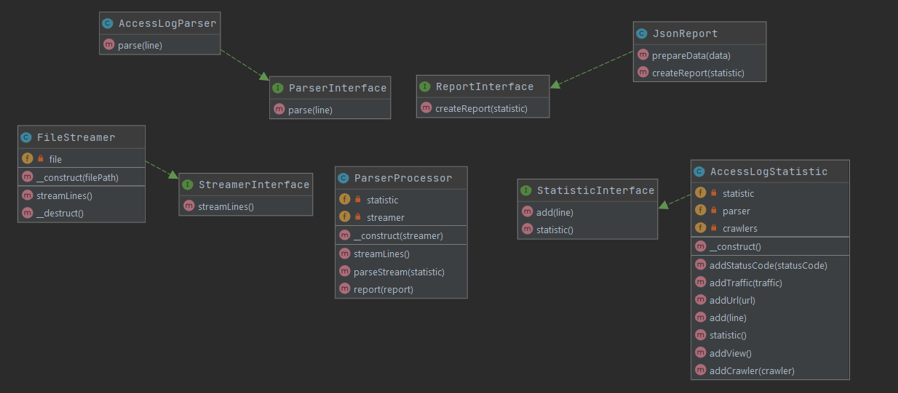

# Тестовое задание Roistat
## Галичин Антон galichin-anton@yandex.ru

# USAGE
## Запустите скрипт parser.php с одним агрументом - путь к файлу
```parser.php access_log.txt```

# Покрытие тестов можно посмотреть здесь
```coverage/index.html```

# Результат команды 
```parser.php access_log.txt```
```{"view":16,"url_count":5,"traffic":212816,"crawlers":{"Google":2,"Bing":0,"Baidu":0,"Yandex":0},"statusCode":{"200":14,"301":2}}```

# Диаграмма классов 

